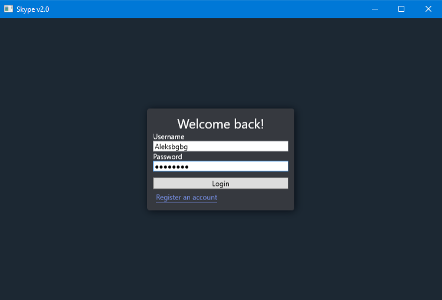
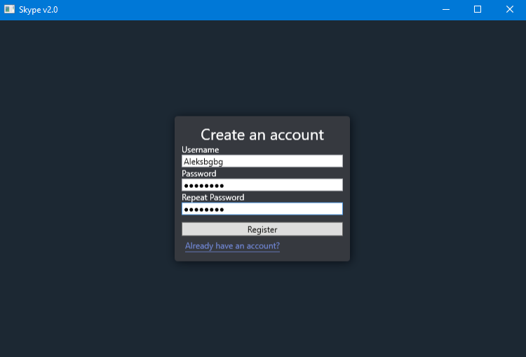
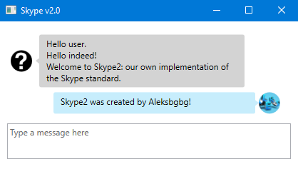

# Skype2 - It's the future!
A desktop chat client, based on the successes of Discord, with the look and feel of Skype.

Skype2 is a Discord-based Skype reboot, serving as an example of a full-scale chat application written entirely in C#.

## Skype2 Architecture
The Skype2 core will consist of the following components:
- A WPF desktop client (C# and XAML).
	- Using the Caliburn.Micro framework to accomplish the MVVM design pattern.
- HTTP REST server endpoint (C#).
	- Using ASP.NET Core to expose a WebAPI.
	- Interacts with a PostgreSQL database service.
		- Performs CRUD operations on the database using the EntityFramework ORM (Object-Relational Mapper).
- TCP socket server endpoint (C#).
	- Using the SimpleTCP library to build a real-time connection between clients for message transmission.

The above-listed components form the main Skype2 experience and are fully written in C#.

## Future Planning
In addition, Skype2 may, in the future, implement some or all of the following:
- Redis in-memory database store.
- JavaScript-based web and desktop client.
- Alternative PHP REST server endpoint using Laravel.
- Alternative C++ TCP socket server.

## Skype2 Preview
### Login

### Register

### Main Chat Interface
